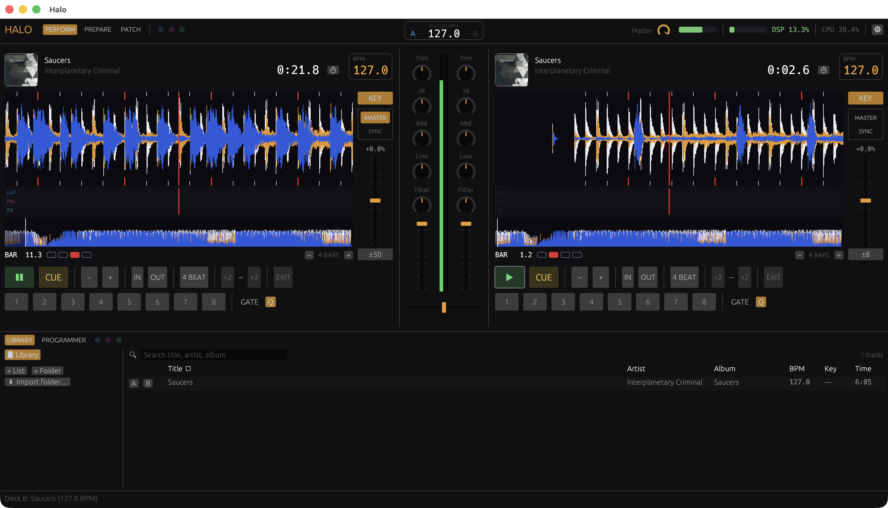

<!-- LOGO -->
<h1>
<p align="center">
  
  <br>Halo
</h1>
</p>
<p align="center">
  <strong>A DJ app with a built-in lighting console.</strong>
</p>

## About

**⭕️ Halo is a DJ app with a built-in lighting console, designed for solo performers who want to deliver immersive
live shows.**

Mix across two decks while Halo drives the lighting rig in sync with your set. Lighting cues can be prepared per track,
then shaped and overridden live from a console-style programmer—so one performer can control the music, the lights, and
the energy of the room from a single app, without relying on a dedicated lighting operator.

Halo is designed to integrate seamlessly with the Ableton Push 2, providing hands-on real-time control and visual
feedback without forcing you to perform through a mouse and keyboard.

Built for macOS in Rust, Halo uses the [`timestretch`](https://github.com/robmorgan/timestretch-rs) engine for
real-time tempo and pitch control.

<p align="center">
  
</p>

> [!WARNING]
> This project is still in heavy development and unsuitable for production use (even though I'm using it for shows).

## Features

### DJ

* **Dual decks** powered by one `timestretch` engine each: warm-start seeks, gapless loop wrap, and keylocked
  tempo control.
* **Full mixer chain** per deck: trim → 3-band isolator EQ (full-kill) → resonant LP/HP filter → channel fader,
  into a constant-power crossfader, master fader, and soft limiter.
* **CDJ-style transport**: play/pause and cue (set while paused, hold to preview, release to return).
* **Hot cues** — 8 per deck, with Normal and Gated modes and optional quantize to the beat grid.
* **Loops** — manual in/out, 4-beat quantized autoloop, and halve/double controls from 1/16 up to 16 beats.
* **Tempo & sync** — tempo slider with ±8/±16/±50% ranges, keylock, pitch-bend nudges, and one-button sync that
  locks BPM and beat phase to a master deck.
* **Audible scrub** with momentum — grab the waveform and hear it, like dragging a platter.
* **Rich waveforms** — 3-band RGB overview strip and a zoomed, centered-playhead view with beat/bar marks,
  rendered from background track analysis.
* **Track library** — SQLite-backed browser with playlists, search, sortable columns (BPM, key, duration, …),
  folder import, and background analysis. BPM comes from analysis; musical key is read from file tags.
* **Prepare & Perform views** — audition tracks on an independent third channel and edit cues in Prepare, then
  play the show in Perform.
* **Meters everywhere** — per-deck and master levels plus an audio-callback CPU meter.

### Lighting

* **Per-track cue lanes** (Lighting / Pixels / FX) under the waveforms, edited directly and persisted in the
  library alongside the track.
* **Console-style programmer** — fixture grid, group selects, and Intensity/Color/Position/Beam/Pixel FX views
  with beat-synced effects; latch or flash overrides sit above track cues, with STORE-from-live.
* **Real fixture engine** — a default rig patched from real fixture profiles, editable live in the PATCH tab
  (profile, universe, address, grid position) and persisted to the library.
* **Art-Net output** — a dedicated 44 Hz engine thread resolves cues + programmer state into per-universe DMX
  frames and sends them over Art-Net (broadcast or unicast to a node), independent of the UI.

See [ROADMAP.md](ROADMAP.md) for the full feature arc and what's next.

## Requirements

* **macOS 12+** (Core Audio via cpal; the UI uses the wgpu backend)
* **Rust toolchain** (stable for building/testing; nightly only for `cargo +nightly fmt`)
* **[`timestretch-rs`](https://github.com/robmorgan/timestretch-rs)** cloned alongside this repo (path dependency)
* **Optional:** an Art-Net node and DMX fixtures for the lighting rig

## Installation

Halo depends on the `timestretch` crate by local path, so clone the two repos side by side:

```bash
git clone https://github.com/robmorgan/halo.git
git clone https://github.com/robmorgan/timestretch-rs.git
cd halo
cargo build --release
```

To build a macOS app bundle (`Halo.app`):

```bash
cargo install cargo-bundle
cargo bundle --release
```

## Usage

```bash
cargo run --release
```

Load tracks through the in-app library or file dialog, or pass a file directly to load it on launch:

```bash
cargo run --release -- path/to/track.mp3
```

* **Prepare view** — import folders into the library, build playlists, audition tracks, and edit per-track
  lighting cues.
* **Perform view** — two decks, mixer, and the lighting programmer.
* **Art-Net** — configure broadcast or unicast-to-node output in the in-app settings window; the choice is
  persisted with the library.
* **Logs** — set `RUST_LOG=debug` (or another filter) when launching from a terminal.

## Documentation

* [ROADMAP.md](ROADMAP.md) — architecture overview, phased feature plan, and current status.

## License

Halo is licensed under the Fair Core License, Version 1.0, ALv2.

## Contributing

Contributions are welcome! Please feel free to submit a Pull Request.
